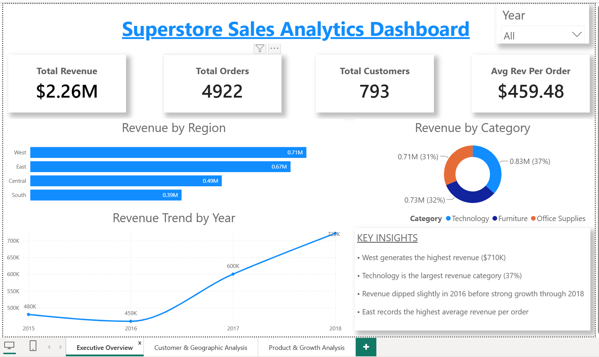
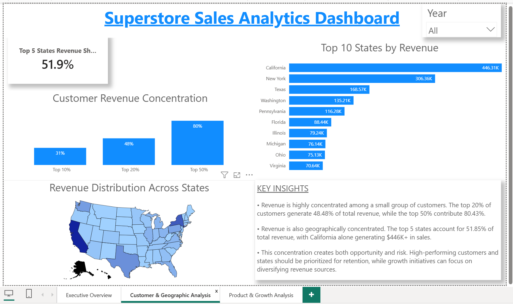
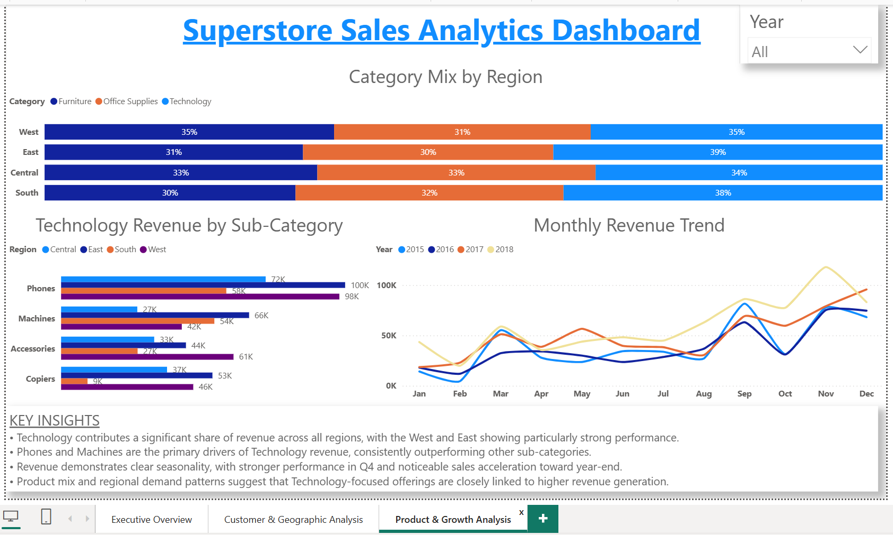

# E-Commerce Sales Analytics

End-to-end Data Analytics project using SQL, Excel and Power BI to analyze sales performance, customer behavior, regional trends and product category performance.

Dataset: Superstore Sales Dataset

Records Analyzed: 9,800

Dashboard Pages: 3

Primary Goal: Transform raw sales data into actionable business insights and interactive dashboards.

## Dashboard Preview

### Executive Overview

### Customer & Geographic Analysis

### Product & Growth Analysis

## Business Problem

The objective of this project was to answer key business questions:

- Which regions generate the highest revenue?
- Which product categories drive business growth?
- How concentrated is revenue among top customers?
- Which states contribute most to sales?
- What seasonal patterns exist in revenue?
- Which technology products perform best?
- Where should management focus future growth efforts?

## Tools Used

- MySQL
- Power BI
- Microsoft Excel
- VS Code
- Git & GitHub

## Project Workflow

1. Dataset Collection
2. Data Validation
3. MySQL Data Import
4. Data Quality Checks
5. SQL Business Analysis
6. Insight Generation
7. Dashboard Design in Power BI
8. Business Recommendations

## SQL Analysis

SQL was used to perform:

- Customer concentration analysis
- Revenue contribution analysis
- Regional sales analysis
- Category performance analysis
- State-level revenue analysis
- Revenue trend analysis

Detailed queries are available in:

SQL/business_analysis.sql

## Key Findings

- Total Revenue: $2.26M
- Total Orders: 4,922
- Total Customers: 793

- Top 10% customers contribute 31.16% of total revenue.
- Top 20% customers contribute 48.48% of total revenue.
- Top 50% customers contribute 80.43% of total revenue.

- California generated the highest revenue ($446K).
- Top 5 states contributed 51.85% of total revenue.

- Technology was the highest-performing category.
- Revenue growth accelerated significantly during 2017–2018.
- Q4 consistently delivered the strongest sales performance.

## Dashboard Pages

### Page 1 – Executive Overview

- Revenue KPIs
- Regional Revenue Analysis
- Category Performance
- Revenue Trends

### Page 2 – Customer & Geographic Analysis

- Customer Concentration Risk
- Top Revenue States
- Geographic Revenue Distribution
- Strategic Insights

### Page 3 – Product & Growth Analysis

- Category Mix by Region
- Technology Product Performance
- Monthly Revenue Trends
- Growth Insights

## Repository Structure

Dataset/
├── superstore_dataset.csv
├── data_dictionary.md

Images/
├── dashboard_page1.png
├── dashboard_page2.png
├── dashboard_page3.png

Notes/
├── mysql_import_troubleshooting.md

PowerBI/
├── ecommerce_sales_analytics_dashboard.pbix

SQL/
├── business_analysis.sql
├── findings.md
├── methodology.md

## Project Outcomes

- Built a complete SQL-to-Power BI analytics workflow.
- Solved MySQL import challenges during data ingestion.
- Conducted business-focused SQL analysis.
- Designed a 3-page interactive dashboard.
- Converted raw transactional data into actionable insights.

## Author

Shivam Kumar Vishwakarma

Aspiring Data Analyst

Skills:
SQL | Excel | Power BI
